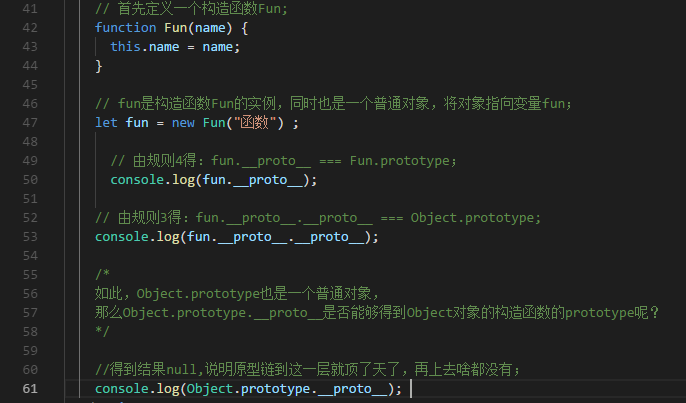

# 原型与原型链

>五条原型规则

```bash
1.所有的引用类型都具有对象的特性（null除外），即可自由扩展属性；

2.所有的引用类型都具有一个__proto__属性，属性值是一个普通对象；

3.所有的函数都有一个prototype属性，属性值是一个普通对象；

4.所有的引用类型，__proto__属性值指向它的构造函数的prototype属性值；

5.当试图获取一个引用类型的属性时，如果自身没有该属性，那么js引擎会从它的__proto__（即它的构造函数的protoytpe）中寻找。

```

>示例

